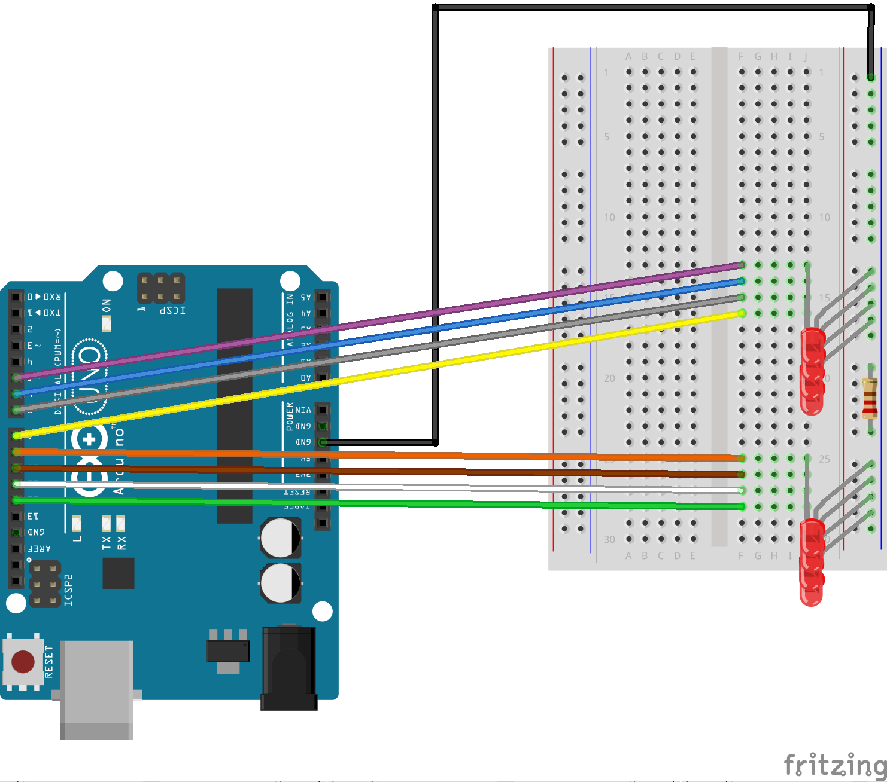

# Siren 🚨

Siren is an Arduino project that I thought of as a follow-up to the *Blinking an LED* project. Its main goal is to blink an even number of LEDs in common patterns found in police cars's sirens.

## Demo

The full video can be found here [here](https://www.youtube.com/watch?v=1XDveX9nsTQ).

## Schematics 

## Pre-requisites

The following individual components:
- 1 Arduino Uno R3 board
- 1 Breadboard
- 9 Jumper Wires
- 1 220Ω Resistor
- 8 LEDs

## Setup

Once you have assembled the project following the above fritzing schema, all you need to do is connect your computer with the Arduino board using an USB cable, download the `main.ino` file, and upload it to the board. Congratulations! You now have your own police siren.

As a follow-up, you can now play with the order of the predefined methods used within the `loop` function and come up with all sorts of new patterns!